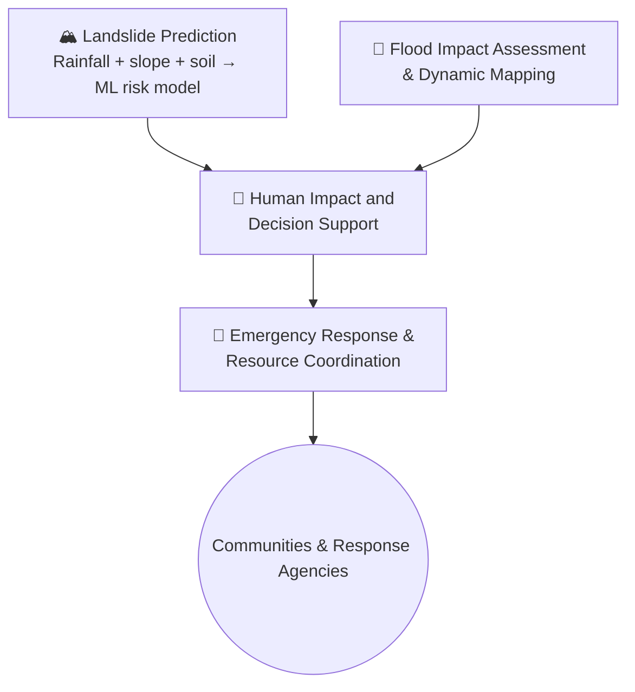
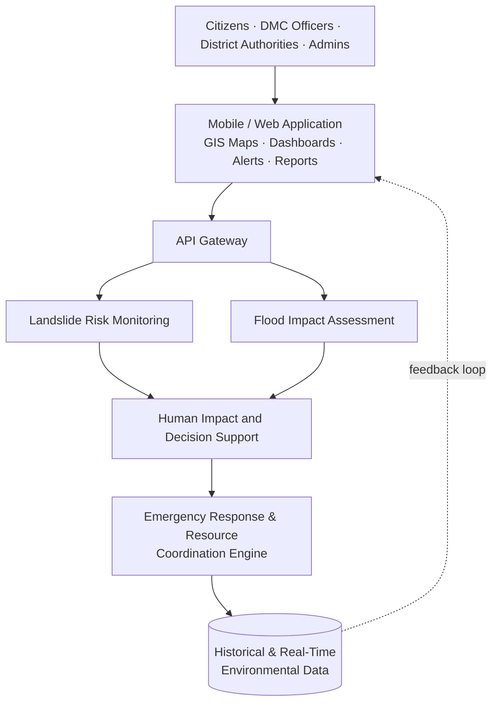

# Integrated Flood and Landslide Risk Assessment for Sri Lanka

**An AI-driven, multi-hazard early warning and emergency response platform — SLIIT IT4010 Research Project**

-0aa)
-success)

---

## 📖 Overview

Sri Lanka's monsoon rainfall, rapid urbanization, deforestation, and shifting land-use patterns make districts like Ratnapura, Kegalle, Badulla, and Nuwara Eliya recurring hotspots for floods and landslides — disasters that cost lives, damage infrastructure, and disrupt transport networks year after year. Agencies such as the Disaster Management Centre (DMC), the Department of Meteorology, and the National Building Research Organization (NBRO) already issue hazard warnings, but they largely operate in isolation, each covering a single hazard, with data scattered across organizations and little support for real-time, evidence-based decision-making.

This project closes that gap with a single AI-driven platform that fuses flood and landslide risk into one pipeline — from raw environmental data, through hazard prediction and prioritized decision support, to coordinated emergency response.

---

## 🔗 System Pipeline

## 🏗️ System Architecture

---

## 🧩 The Four Components

| Component | Focus | Owner |
|---|---|---|
| 🏔️ **Landslide Prediction** | Multi-factor ML risk modeling with explainable, village-level alerts | Bagya R M S — *IT23394124* |
| 🌊 **Flood Impact Assessment & Dynamic Mapping** | Multi-source data fusion for flood severity, extent, and impact prediction | Sinhalagoda S.A.U.R.A.V — *IT23280892* |
| 🧭 **Human Impact and Decision Support** | Fuses flood/landslide risk with population vulnerability into prioritized, explainable alerts | Prathibhani Y.L.O.L — *IT23317512* |
| 🚨 **Emergency Response & Resource Coordination** | Real-time, resource-aware dispatch and route optimization | Palihena M.B — *IT23411562* |

---

## 🎯 Component Details

### 🏔️ Landslide Prediction — *Bagya R M S*
Pilot region: Nuwara Eliya District (Ambagamuwa, Kotmale, Walapane DS Divisions).

- **Multi-factor probability calculation** — correlates dynamic rainfall volumes with static slope geometry and soil saturation in real time.
- **Inclusive, localized live mapping** — a Web-GIS interface with high-contrast, accessible themes for elderly citizens and dual-language localization for village-level alerts.
- **Explainable micro-level terrain failure analysis** — an XAI layer that breaks each prediction down into its environmental vs. human-factor contribution, down to town/village granularity.

### 🌊 Flood Impact Assessment & Dynamic Mapping — *Sinhalagoda S.A.U.R.A.V*
- **Multi-source data fusion** — combines river levels, DEM, land use, population exposure, historical flood records, and satellite imagery in a single AI framework.
- **Impact-focused assessment** — predicts flood severity and expected damage, not just occurrence.
- **AI + satellite validation** — real-time imagery validates and updates flood extent maps.
- **Explainable AI** — surfaces the reasoning behind each flood risk prediction.

### 🧭 Human Impact and Decision Support — *Prathibhani Y.L.O.L*
- **Multi-hazard cascading fusion** — formally models flood–landslide interaction and temporal overlap into a joint hazard score.
- **Vulnerability- and infrastructure-aware prioritization** — weights population vulnerability (density, elderly, children, disabled) and proximity to hospitals, shelters, schools, and roads.
- **Decision-centered integration** — turns raw predictions into prioritized, actionable alerts for authorities and citizens.
- **Explainable, confidence-aware alerts** — transparent rationale and uncertainty estimates to reduce false alarms.

### 🚨 Emergency Response & Resource Coordination — *Palihena M.B*
- **Real-time resource-aware dispatch** — checks live availability of boats, ambulances, and shelter capacity at DDMCs before committing resources.
- **Hazard-aware dual route optimization** — generates safe routes for both citizen evacuation and rescue-team deployment, dynamically avoiding affected roads.
- **Scarcity-based priority queuing** — sequences limited resources across districts by urgency.
- **Multi-channel dispatch** — automates alert delivery to coordinators and citizens via SMS/app, replacing manual phone/radio coordination.

---

## 📚 Related Work

Recent Sri Lankan research has applied GIS, hydrological modelling, remote sensing, and machine learning to hazard prediction and susceptibility mapping — including a Random Forest-based landslide susceptibility model for the Kalutara District and an agentic AI framework for human-centered disaster response. These efforts, however, remain single-hazard and prediction-focused. This project's contribution is a unified pipeline that integrates flood prediction, landslide prediction, decision support, and emergency response coordination into one platform.

---

## 🛠️ Tech Stack

<table>
<tr><td><b>Machine Learning</b></td><td>Python, Scikit-learn, TensorFlow, XGBoost, LightGBM, Random Forest</td></tr>
<tr><td><b>Explainability</b></td><td>SHAP, LIME</td></tr>
<tr><td><b>GIS & Spatial</b></td><td>QGIS, PostgreSQL + PostGIS, OSMnx, Google Earth Engine</td></tr>
<tr><td><b>Mapping</b></td><td>MapLibre GL JS / Mapbox GL JS / Leaflet</td></tr>
<tr><td><b>Frontend</b></td><td>React.js / Vue.js, Tailwind CSS, Radix UI / Headless UI</td></tr>
<tr><td><b>Localization</b></td><td>i18next / react-i18next</td></tr>
</table>

---

## 👥 Team

| Name | Student ID | Component |
|---|---|---|
| Bagya R M S | IT23394124 | Landslide Prediction |
| Sinhalagoda S.A.U.R.A.V | IT23280892 | Flood Impact Assessment |
| Prathibhani Y.L.O.L | IT23317512 | Human Impact and Decision Support |
| Palihena M.B | IT23411562 | Emergency Response & Resource Coordination |

**Supervisor:** Dr. Kapila Dissanayaka
**Co-Supervisor:** Mr. Uchira Wickramarathne

Center of Excellence for Artificial Intelligence (CEAI) · SLIIT IT4010 · Project ID **J26-IT-334**

---

## 🗺️ Project Status

- [x] Topic proposed & feasibility study completed
- [x] Topic Assessment reviewed and accepted (minor changes requested)
- [x] System architecture & conceptual diagrams drafted
- [x] Core objectives, tasks, and novelty defined per component
- [ ] Data acquisition & preprocessing pipeline
- [ ] ML model training & validation per component
- [ ] Human Impact and Decision Support fusion engine
- [ ] Emergency response dispatch & routing engine
- [ ] Cross-component integration
- [ ] Field testing in pilot districts

---

## 📄 License

License to be determined ahead of the project's public release.

---

<i>Built at SLIIT's Center of Excellence for Artificial Intelligence, for the communities of Sri Lanka most exposed to flood and landslide risk.</i>

